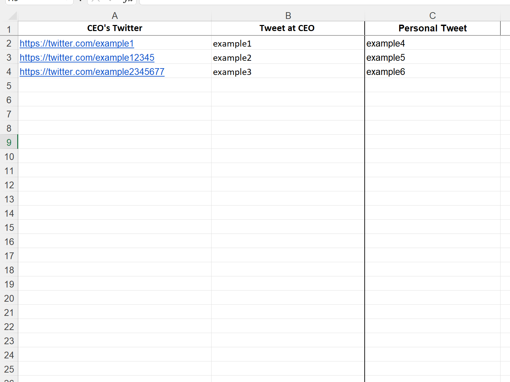
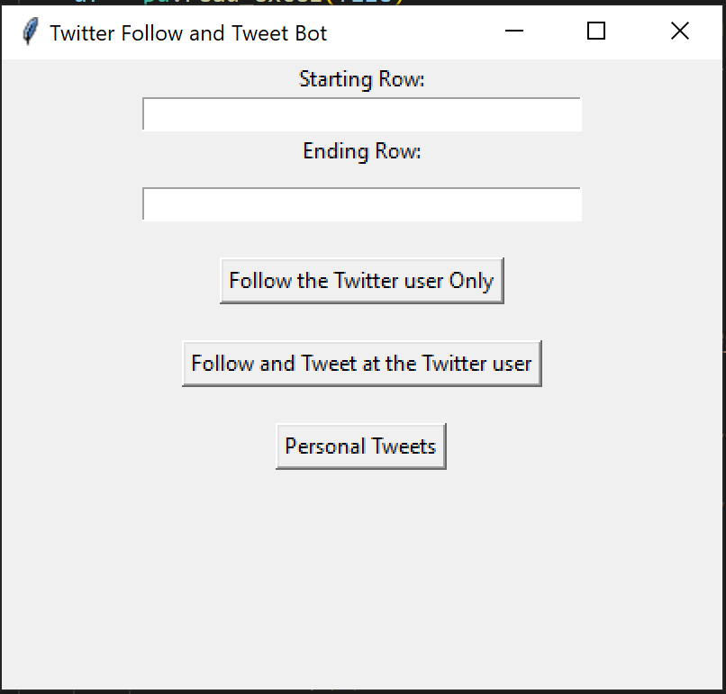

# bot_follow_post_twitter-server-interface

1. 
Navigate from dist to the twitter folder. Open twitter.xlsx

Enter the URL of the twitter accounts you would like to follow and the content of the tweet into the "CEO's Twitter" and "Tweet" column respectively".

2. Run twitter.exe located in the same folder. 

3.  

Enter the rows you would like to run. For example, from 2nd to 4th. You are recommended to run it in batches to prevent getting banned by twitter. 

5. Once you run twitter.exe, the chrome browser will appear. You have 90 seconds to enter your twitter credentials and get logged in manually. 

6. After the 90 seconds, the programme will automatically follow the twitter profile and tweet at the person with the content input.