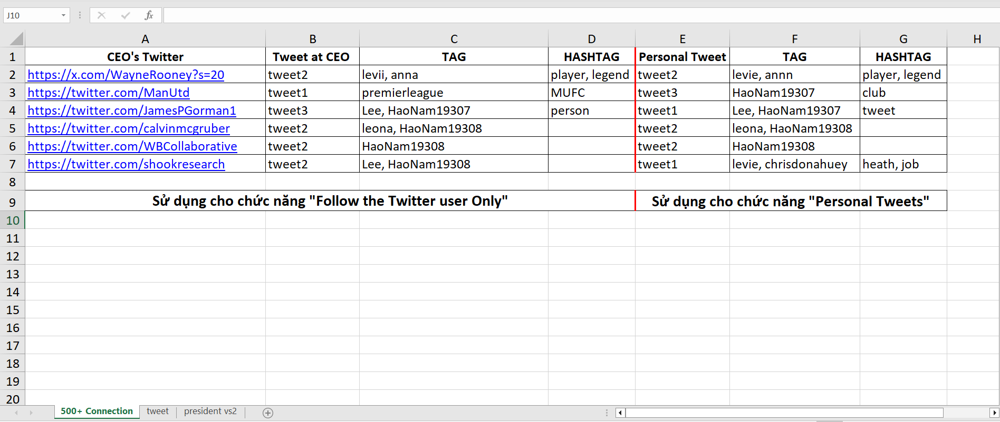
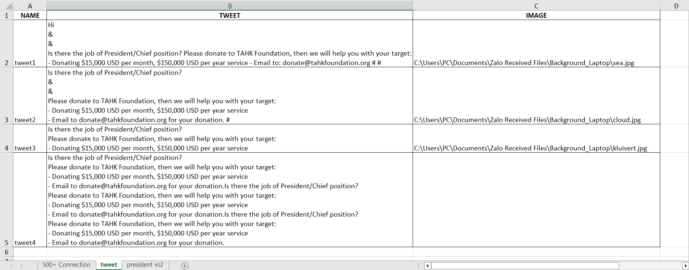
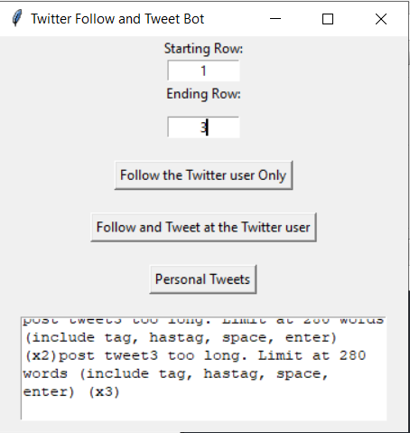

# bot_follow_and_post_twitter-server-interface

Cách sử dụng bot tự động theo dõi User và đăng bài lên twitter

1. Mở file input.xlsx.

# Sheet 500+ Connection

# Sheet Tweet

# Ở sheet 500+ Connection

A. CEO's Twitter: Hãy điền đường dẫn URL tới profile accounts cần theo dõi

B. Tweet at CEO: điền tên bài tweet lấy từ cột "NAME" của sheet "tweet"

C. TAG: Tag người khác vào bài tweet, hãy điền vào userId, ví dụ: levii, anna

D. HashTAG:  ví dụ: player, legend
	Số lượng tag và hashtag xuất hiện tùy vào số lượng ký tự "&" và "#" trong Tweet ở sheet "tweet"

E. Personal Tweet: điền tên bài tweet lấy từ cột "NAME" của sheet "tweet"

F, G. Tương tự C,D

# Ở Sheet Tweet

A. Đặt tên cho bài tweet (không được trùng tên)

B. Nội dung bài tweet.

	- Dấu & sẽ được chương trình thay thế lần lượt cho các TAG ở sheet 500+ connection
	- Dấu # sẽ được chương trình thay thế lần lượt cho các HASHTAG ở sheet 500+ connection
	- Số lượng dấu & và # có thể thêm vào theo ý muốn và vị trí bất kỳ.
 
C. Thêm hình ảnh cho bài tweet.

	- Để lấy đúng đường dẫn hình ảnh hãy: chuột phải hình ảnh -> chọn properties -> chọn Security
	hoặc lấy đường dẫn theo cách nào khác bạn biết
	- Chỉ thêm được 1 hình ảnh cho 1 bài viết

2. Chạy file twitter.exe nằm ở cùng folder.
   Một trình duyệt sẽ xuất hiện, hãy đăng nhập vào twitter.
   Sau khi đăng nhập thành công sẽ xuất hiện cửa sổ dưới

    * Starting Row và Ending Row: Nhập vào số dòng User muốn bắt đầu và kết thúc ở sheet 500+ connection
	Ví dụ: nếu nhập 1 và 3 thì chương trình sẽ chọn 3 dòng dữ liệu đầu tiên ở sheet 500+ connection
    * Follow the Twitter user only: Chỉ follow các Profile bạn đã chọn.
    * Follow and Tweet at the Twitter user: Follow và đăng bài viết các dòng đã chọn.
    * Personal Tweets: Đăng bài viết cá nhân theo các dòng đã chọn.
    * Ô message: Các bài viết quá dài sẽ không đăng được và note lại ở đây. Hãy theo dõi để sửa.

*Kết quả của một bài viết đúng.

